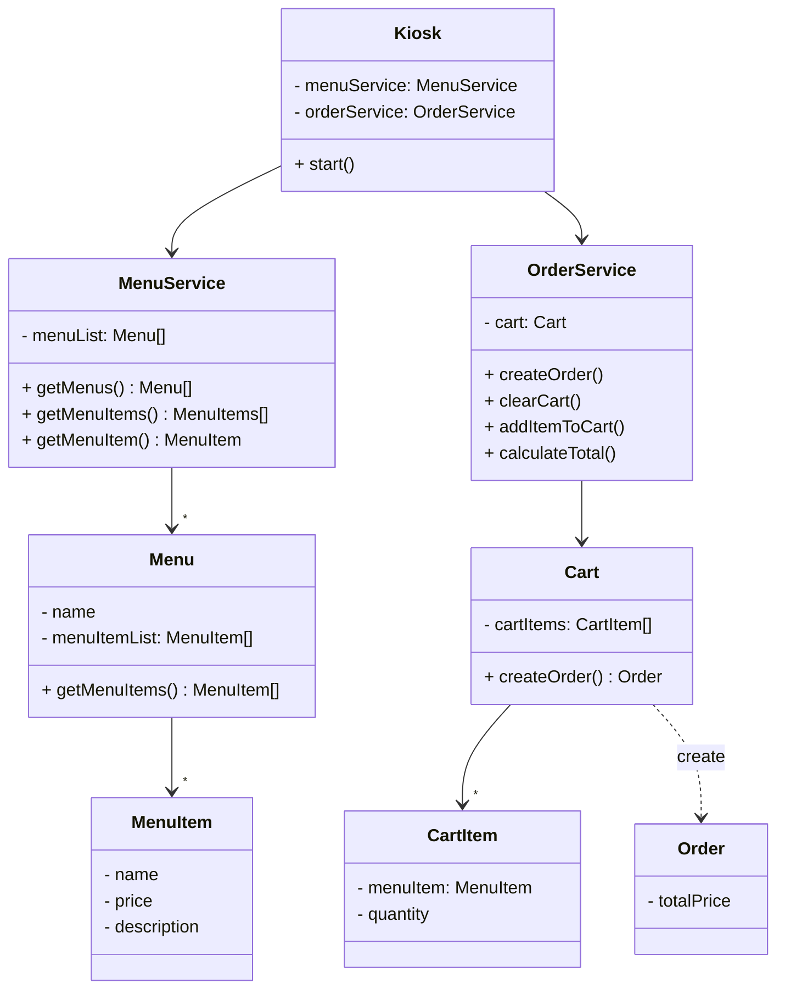

# Kiosk CLI 서비스

CLI 환경에서 사용자에게 음식 메뉴 정보를 제공하고, 주문하도록 하는 서비스 입니다.

아래 링크를 통해 각 단계별 브랜치로 이동하여 코드를 확인하실 수 있습니다.


## 구현 과정

| 단계                                                                                      | 내용                                                                                    |
|-----------------------------------------------------------------------------------------|---------------------------------------------------------------------------------------|
| [필수 Level1](https://github.com/yeongbinim/kioskProject/blob/lv1_basic-kiosk/README.md)ㅤㅤㅤ| (🎁 feature) **사용자는 CLI 환경에서 메뉴를 확인하고 상세보기를 할 수 있다.**                                 |
| [필수 Level2](https://github.com/yeongbinim/kioskProject/blob/lv2_refactor-menuitem/README.md)ㅤㅤㅤ| (🛠 refactor) 메뉴아이템은 MenuItem 클래스로 관리하고, 이 MenuItem을 관리하는 List를 사용                    |
| [필수 Level3](https://github.com/yeongbinim/kioskProject/blob/lv3_refactor-kiosk/README.md)ㅤㅤㅤㅤ| (🛠 refactor) main 함수에서 관리하던 입력과 반복문 로직은 Kiosk 클래스의 start 함수에게 위임                     |
| [필수 Level4](https://github.com/yeongbinim/kioskProject/blob/lv4_feature-menu/README.md)ㅤㅤㅤㅤ| (🎁 feature) **사용자는 메뉴아이템 선택 이전에 메뉴를 선택할 수 있다.**                                      |
| [필수 Level5](https://github.com/yeongbinim/kioskProject/blob/lv5_refactor-encapsulation/README.md) | (🛠 refactor) Kiosk는 사용자 입출력에 집중하고, 처리 로직은 MemberService에, 포매팅은 KioskFormatter로 책임 분리 |
| [도전 Level1](https://github.com/yeongbinim/kioskProject/blob/ch1_feature-cartorder/README.md) | (🎁 feature) **사용자는 선택한 메뉴를 장바구니에 추가하고, 주문할 수 있다.**                                   |

## 최종 결과물

[[코드 보러 가기]](./src/main/java)
```
src/
├── OrderApp.java
├── controller/
├    ├── KioskFormatter.java
├    └── Kiosk.java
└── service/
     ├── MenuService.java
     ├── OrderService.java
     └── domain/
          ├── Cart.java
          ├── Order.java
          ├── Menu.java
          └── MenuItem.java
```

### 클래스 다이어그램




### 기능 화면

<div align="center">

</div>
