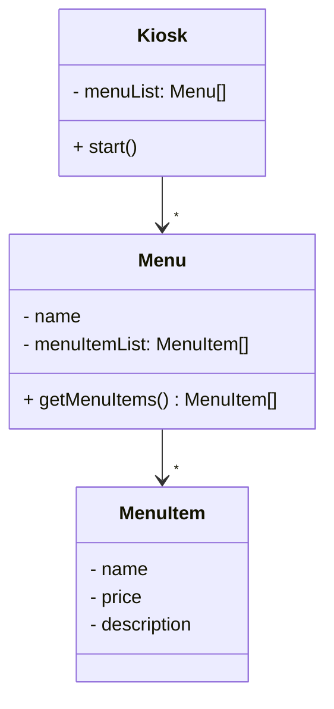

## Kiosk Level 4

[[코드 보러 가기]](./src/main/java)

```
src/
 ├── OrderApp.java
 ├── Kiosk.java
 └── domain/
      ├── Menu.java
      └── MenuItem.java
```

### 클래스 다이어그램


```mermaid

classDiagram

class MenuItem {
- name
- price
- description
}

class Menu {
- name
- menuItemList: MenuItem[]
+ getMenuItems() MenuItem[]
}

class Kiosk {
- menuList: Menu[]
+ start()
}

Kiosk -->"*" Menu

Menu -->"*" MenuItem

```

### 기능 화면


