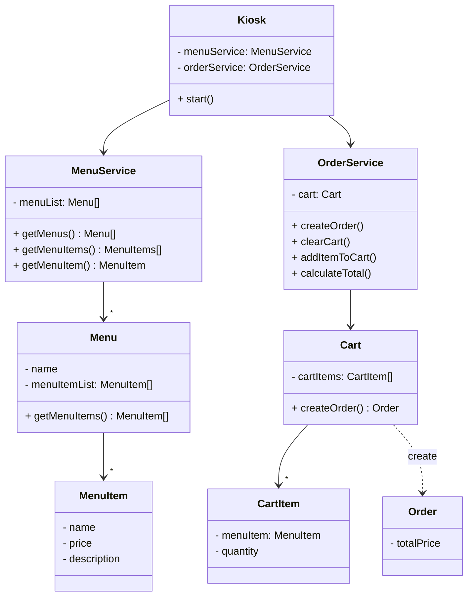

## Kiosk Challenge 1

(🎁 feature) 사용자는 선택한 메뉴를 장바구니에 추가하고, 주문할 수 있다.

[[코드 보러 가기]](./src/main/java)
```
src/
├── OrderApp.java
├── controller/
├    ├── KioskFormatter.java
├    └── Kiosk.java
└── service/
     ├── MenuService.java
     ├── OrderService.java
     └── domain/
          ├── Cart.java
          ├── Order.java
          ├── Menu.java
          └── MenuItem.java
```

### 클래스 다이어그램




### 기능 화면

<div align="center">

</div>

