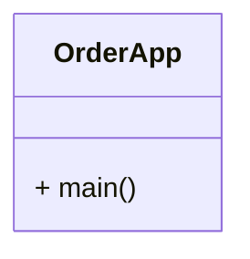

## Kiosk Level 1

(🎁 feature) **사용자는 CLI 환경에서 메뉴를 확인하고 상세보기를 할 수 있다.**

[[코드 보러 가기]](./src/main/java)

```
src/
 └── OrderApp.java
```

### 클래스 다이어그램


```mermaid
classDiagram

class OrderApp {
+ main()
}


```

### 기능 화면


