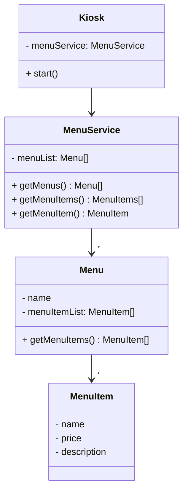

## Kiosk Level 5

(🛠 refactor) Kiosk는 사용자 입출력에 집중하고, 처리 로직은 MemberService에, 포매팅은 KioskFormatter로 책임 분리

[[코드 보러 가기]](./src/main/java)

```
src/
 ├── OrderApp.java
 ├── controller/
 ├    ├── KioskFormatter.java
 ├    └── Kiosk.java
 └── service/
      ├── MenuService.java
      └── domain/
            ├── Menu.java
            └── MenuItem.java
 
```

### 클래스 다이어그램



### 기능 화면

기능은 level4와 동일합니다.


