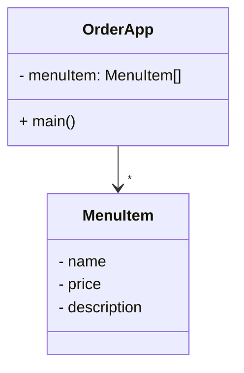

## Kiosk Level 2

(🛠 refactor) 메뉴아이템은 MenuItem 클래스로 관리하고, 이 MenuItem을 관리하는 List를 사용 

[[코드 보러 가기]](./src/main/java)

```
src/
 ├── OrderApp.java
 └── domain/
      └── MenuItem.java
```

### 클래스 다이어그램



### 기능 화면

기능은 level1과 동일합니다. MenuItem이 분리되었습니다.


